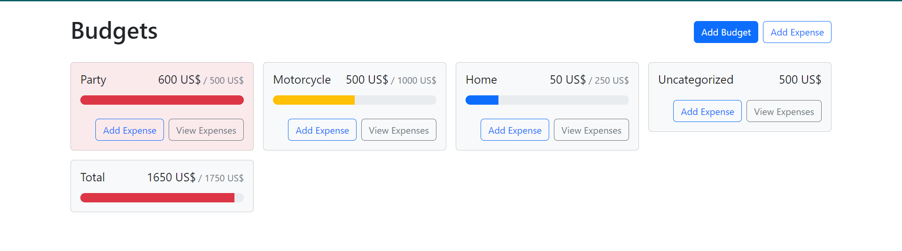

# budgets-app

Introducing a budget tracking app built with React and React-Bootstrap. With this app, you have the ability to add budgets by inputting the budget name and the maximum amount to spend. You can add as many budgets as you need. For each budget, you can input the expenses you make, and a progress bar will show you how much of the budget you have spent and how much you have left. The color of the progress bar changes (from primary to warning and finally to danger) depending on how much of the budget you have already spent. This app provides an easy and effective way to track your spending and stay on top of your budgeting goals. Additionally, the app features an "Uncategorized" category for expenses that do not have a specific budget name assigned to them. This allows users to keep track of all their expenses, even if they forget to assign them to a particular budget. With this feature, users can have a complete overview of their spending habits and make more informed decisions about their finances.
